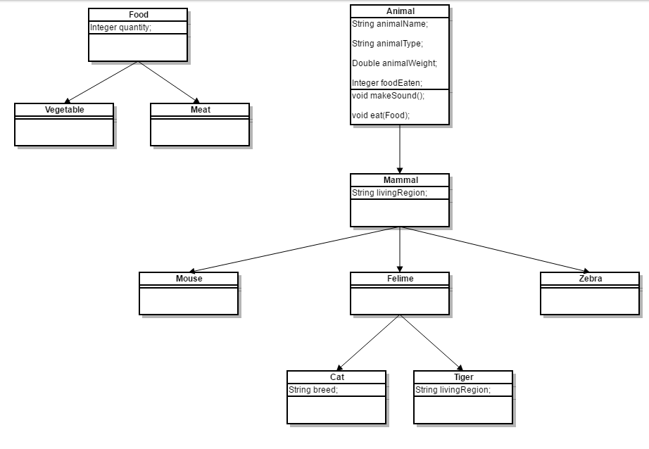

Exercises: Polymorphism
=======================

Problems for exercises and homework for the ["Java OOP" course \@
SoftUni](https://softuni.bg/trainings/2245/java-oop-february-2019).

You can check your solutions here:
<https://judge.softuni.bg/Contests/1589/Polymorphism-Exercises>.

Vehicles
--------

Write a program that models 2 vehicles (**Car** and **Truck**) and will be able
to simulate **driving** and **refueling** them in the summer. **Car** and
**truck** both have **fuel quantity**, **fuel consumption in liters per km** and
can be **driven given distance** and **refueled with given liters.** But in the
**summer** both vehicles use air conditioner and their **fuel consumption** per
km is **increased** by **0.9** liters for the **car** and with **1.6** liters
for the **truck**. Also the **truck** has a tiny hole in his tank and when it
gets **refueled** it gets only **95%** of given **fuel**. The **car** has no
problems when refueling and adds **all given fuel to its tank.** If vehicle
**cannot** travel given distance its fuel does not change.

**Input**

-   On the **first line** - information about the car in format **{Car {fuel
    quantity} {liters per km}}**

-   On the **second line** – info about the truck in format **{Truck {fuel
    quantity} {liters per km}}**

-   On third line - **number of commands N** that will be given on the next
    **N** lines

-   On the next **N** lines – commands in format

-   **Drive Car {distance}**

-   **Drive Truck {distance}**

-   **Refuel Car {liters}**

-   **Refuel Truck {liters}**

**Output**

After each **Drive command** print whether the Car/Truck was able to travel
given distance in format if it’s successful. **Print the distance with two
digits after the decimal separator except trailing zeros.** Use the
**DecimalFormat** class:

>   **Car/Truck travelled {distance} km**

Or if it is not:

>   **Car/Truck needs refueling**

Finally print the **remaining fuel** for both car and truck rounded **2 digits
after floating point** in format:

>   **Car: {liters}**

>   **Truck: {liters}**

### Example

| **Input**                                                                                                         | **Output**                                                                                |
|-------------------------------------------------------------------------------------------------------------------|-------------------------------------------------------------------------------------------|
| Car 15 0.3 Truck 100 0.9 4 Drive Car 9 Drive Car 30 Refuel Car 50 Drive Truck 10                                  | Car travelled 9 km Car needs refueling Truck travelled 10 km Car: 54.20 Truck: 75.00      |
| Car 30.4 0.4 Truck 99.34 0.9 5 Drive Car 500 Drive Car 13.5 Refuel Truck 10.300 Drive Truck 56.2 Refuel Car 100.2 | Car needs refueling Car travelled 13.5 km Truck needs refueling Car: 113.05 Truck: 109.13 |

Vehicles Extension
------------------

Use your solution of the previous task for starting point and add more
functionality. Add new vehicle – **Bus**. Now every vehicle has **tank
capacity** and fuel quantity **cannot fall below 0** (If fuel quantity become
less than 0 **print** on the console **“Fuel must be a positive number”**).

The **vehicles cannot be filled** with fuel **more than their tank capacity**.
If you **try to put more fuel** in the tank than the **available space,** print
on the console **“Cannot fit fuel in tank”** and **do not add any fuel** in
vehicles tank.

Add **new command** for the bus. The **bus** can **drive with or without
people**. If the bus is driving **with people**, the **air-conditioner is turned
on** and its **fuel consumption** per kilometer is **increased with 1.4
liters**. If there are **no people in the bus** when driving the air-conditioner
is **turned off** and **does not increase** the fuel consumption.

### Input

-   On the first three lines you will receive information about the vehicles in
    format:

    **Vehicle {initial fuel quantity} {liters per km} {tank capacity}**

-   On fourth line - **number of commands N** that will be given on the next
    **N** lines

-   On the next **N** lines – commands in format

    -   **Drive Car {distance}**

    -   **Drive Truck {distance}**

    -   **Drive Bus {distance}**

    -   **DriveEmpty Bus {distance}**

    -   **Refuel Car {liters}**

    -   **Refuel Truck {liters}**

    -   **Refuel Bus {liters}**

### Output

-   After each **Drive command** print whether the Car/Truck was able to travel
    given distance in format if it’s successful:

    **Car/Truck/Bus travelled {distance} km**

-   Or if it is not:

    **Car/Truck/Bus needs refueling**

-   If given fuel is **≤ 0** print **“Fuel must be a positive number”.**

-   If given fuel cannot fit in car or bus tank print **“Cannot fit fuel in
    tank”**

-   Finally print the **remaining fuel** for car, truck and bus rounded **2
    digits after floating point** in format:

    **Car: {liters}**

    **Truck: {liters}**

    **Bus: {liters}**

### Example

| **Input**                                                                                                                                                                      | **Output**                                                                                                                                                                                                        |
|--------------------------------------------------------------------------------------------------------------------------------------------------------------------------------|-------------------------------------------------------------------------------------------------------------------------------------------------------------------------------------------------------------------|
| Car 30 0.04 70 Truck 100 0.5 300 Bus 40 0.3 150 8 Refuel Car -10 Refuel Truck 0 Refuel Car 10 Refuel Car 300 Drive Bus 10 Refuel Bus 1000 DriveEmpty Bus 100 Refuel Truck 1000 | Fuel must be a positive number Fuel must be a positive number Cannot fit fuel in tank Bus travelled 10 km Cannot fit fuel in tank Bus needs refueling Cannot fit fuel in tank Car: 40.00 Truck: 100.00 Bus: 23.00 |

Wild farm
---------

Your task is to create a class **hierarchy** like the picture below. All the
classes except **Vegetable**, **Meat**, **Mouse**, **Tiger**, **Cat** &
**Zebra** should be **abstract**.

Input should be read from the console. Every **even** line will contain
information about the Animal in following format:

**{AnimalType} {AnimalName} {AnimalWeight} {AnimalLivingRegion} [{CatBreed}** *=
Only if its cat***]**

On the **odd** lines you will receive information about the food that you should
give to the Animal. The line will consist of **FoodType** and **quantity**
separated by a whitespace.

You should build the logic to determine if the animal is going to eat the
provided food. The Mouse and Zebra should check if the food is a Vegetable. If
it is they will eat it. Otherwise you should print a message in the format:

**{AnimalType} are not eating that type of food!**

**Cats** eat **any** kind of food, but **Tigers** accept **only Meat**. If
**Vegetable** is provided to a **tiger** message like the one above should be
printed on the console.

After you read information about the Animal and Food then invoke **makeSound()**
method of the current animal and then feed it. At the end print the whole object
and proceed reading information about the next animal/food. The input will
continue until you receive “**End**”. After that print the information of all
received animals in format:

**{AnimalType} [{AnimalName}, {CatBreed}, {AnimalWeight}, {AnimalLivingRegion},
{FoodEaten}]**

Print all **AnimalWeight** with no trailing zeroes after the decimal separator.
Use the **DecimalFormat** class.

**Note**: consider overriding toString() method.

### Example

| **Input**                                 | **Output**                                                                      |
|-------------------------------------------|---------------------------------------------------------------------------------|
| Cat Gray 1.1 Home Persian Vegetable 4 End | Meowwww Cat[Gray, Persian, 1.1, Home, 4]                                        |
| Tiger Typcho 167.7 Asia Vegetable 1 End   | ROAAR!!! Tigers are not eating that type of food! Tiger[Typcho, 167.7, Asia, 0] |
| Zebra Doncho 500 Africa Vegetable 150 End | Zs Zebra[Doncho, 500, Africa, 150]                                              |
| Mouse Jerry 0.5 Anywhere Vegetable 0 End  | SQUEEEAAAK! Mouse[Jerry, 0.5, Anywhere, 0]                                      |
